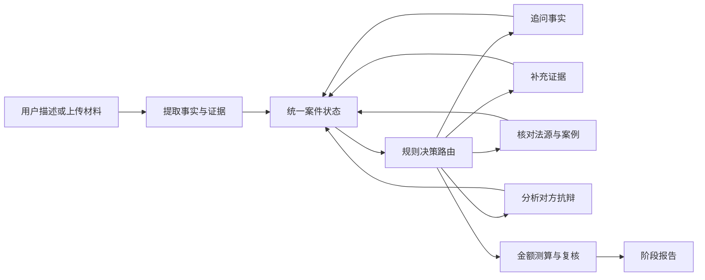

# LexPilot / 律策

面向多领域法律咨询的主动式行动辅助工具。系统从用户的实际诉求出发，逐轮整理事实、证据、适用地区和处理进展，结合个案语义分析、分领域清单与法源线索形成具体实施步骤。原有劳动争议专门流程继续保留。

## AI+ 应用大赛版本

新增 **官方条文检索 → 有条件生成 → 引用检查 → 至多一次纠错 → 行动方案 → Word/PDF 下载** 闭环。已导入 8 部法律法规的 79 个官方条文快照，使用 SQLite FTS5 中文 BM25 与加权 RRF 检索；保留事实 ID、原文片段、来源链接、版本条件与内容哈希。咨询者身份影响请求和抗辩方向，方案写明建议日期、办理入口、材料、操作、完成标志和失败替代路线。

新增 **证据反事实沙盘**：不只列“还缺什么”，还逐项说明材料如果支持、相互冲突或最终拿不到，当前请求、抗辩和下一步准备应如何调整。排序优先考虑已经上传或用户称有的材料，全程不生成胜率；同一结构进入网页、API、Markdown、Word 和 PDF。

新增 **自助—人工接力通行证**：根据紧急提示、正式程序、涉外因素、事实冲突、领域复杂度和用户明确表达的协助需要，透明选择“可先自助／协助自助／优先核对／立即接力”。通行证同时整理事实快照、未决问题、材料缺口、联系话术、隐私清单和完成标志，避免用户转到窗口或专业人员后从头复述。

新增 **本轮方案变更回执**：每次补充事实、纠正表述或上传材料后，比较前后两份结构化快照，说明哪些事实、材料状态、建议路线、接力强度和行动步骤发生变化、变化原因及影响；没有实质变化时也明确告知。回执只描述决策过程，不生成胜率或结果概率。

参考方法、代码入口、外部 API 配置、复现实验和能力边界见 [参赛技术说明](docs/competition-upgrade.md)。研究方法属于工程借鉴；没有训练或声称复现 Self-RAG 模型，也没有把检索命中率称为法律回答准确率。

## 多领域咨询升级

- 15 个专门领域及综合接谈：劳动、婚姻、借贷、房产、消费、合同、公司、知识产权、继承、交通、医疗、侵权、刑事、行政、执行。
- 每轮结合前文追问，记录“不知道”和“没有更多材料”，保存事实时间线、更正记录及取证任务。
- 随时输入“先给我具体方案”或点击“生成当前方案”，得到办理渠道、材料、操作、时间节点、失败后替代路线、费用和文书草稿；补充后继续更新。
- 有官方来源的基础规则和待核验搜索线索分开显示；不会将目录链接或搜索摘要标成已验证结论。
- 刑事措施、人身安全和紧迫期限优先处理，涉外或港澳台案件先核对适用法。
- 证据沙盘显示“支持／冲突／拿不到”三条分支和完成标志，帮助用户理解一份新材料会改变什么、不会自动证明什么。
- 接力通行证说明为什么适合继续自助或应转人工，并把当前案件整理成可安全转交的最小摘要；判断规则和触发信号可审计，不使用胜诉概率。

当前不是全量实时法律库，通用报告是现有信息下的阶段方案。详细设计、知识来源、验证方式及实际边界见 [升级说明](docs/general-consultation-upgrade.md)。

当前 Web 与 API 均固定使用规则决策，不需要强化学习训练、人工标注或模型 checkpoint。
规则负责动作路由与数据校验；语义模型用于有来源约束的事实提取、初步个案分析及行动草案。劳动专门流程保留证据链、时效和引用核验；通用方案明确标记尚待核验的法律适用与事实条件，不能把生成检查视作法律意见正确性的证明。

## 保留的劳动争议专门能力

- 覆盖试用期辞退、违法解除、未签劳动合同、欠薪、加班费、经济补偿与赔偿金。
- 多轮追问会结合上一轮问题理解“签了”“三年”“六个月”等省略回答。
- 统一案件状态保存事实、证据、法源、争点、风险、补偿估算和处理记录。
- 证据缺口区分“已有支持、部分支持、尚缺材料、存在冲突”四种状态；材料可信度另分为“用户自述、已上传待核验、人工已核验”，上传本身不等于事实已证明。
- 支持上传 PDF、Word、图片、文本、表格等案件材料，并自动登记、去重与分类。
- 输出对方可能抗辩、法律依据、风险、建议行动和可下载的阶段报告。
- Streamlit 工作台与 FastAPI 接口共享同一套规则流程。
- 案件事实、证据、法律要件和法条会组成可追溯的三层证据推理图。
- 主动追问综合法律重要度、预期信息增益、要件覆盖、证据利用和交互成本动态排序。
- 报告生成前执行事实溯源、官方引用、法条时效和要件支持四类校验；不足时继续追问、索证或拒绝确定性结论。

## 三项可信智能升级

### 证据链 GraphRAG

`backend/legal_domain/labor/evidence_graph.py` 将每个案件物化为“事实—证据—法律要件—法条”图。法律检索不再只依赖关键词，而会使用尚未解决的要件扩展检索词，并将每条检索结果关联回具体要件。图中的每条路径都保留事实覆盖、证据覆盖、法源关联和支持度。

### 信息增益主动追问

`backend/legal_domain/labor/inquiry.py` 为每个候选问题计算可检查的分数：

```text
问题价值 = 法律重要度 + 预期信息增益 + 要件覆盖 + 证据利用 + 冲突紧迫度 - 交互成本
```

系统仍使用经过审核的问题模板，但提问顺序会随案件状态和证据变化，不让语言模型自由编造调查问题。

### 可验证生成与拒答

`backend/legal_domain/labor/verification.py` 在报告生成前核验：事实是否可追溯、引用是否来自官方来源、法条在案件发生日是否有效、生成结论引用的事实/要件/法条 ID 是否真实相连。未达到门槛时不生成确定性法律结论。

## 处理流程



每个处理步骤都会写入案件记录。规则只决定“下一步做什么”，事实抽取、证据解析、法律检索和金额计算分别由对应模块完成。

## 快速开始

不安装 Python 的朋友可直接使用 [Windows 与 macOS 桌面安装包说明](docs/desktop-installers.md)。GitHub 仓库推送 `v0.1.0` 这类版本标签后，会自动构建 Windows x64、Apple Silicon Mac 和 Intel Mac 三个未签名试用包，并添加到该版本的 GitHub Release。首次发布可照着 [Windows PowerShell 发布步骤](docs/publish-to-github-powershell.md) 操作。

建议使用 Python 3.10 或更高版本：

```powershell
python -m venv .venv
.\.venv\Scripts\Activate.ps1
python -m pip install -r requirements.txt
```

启动 Web：

```powershell
streamlit run app.py
```

启动 API：

```powershell
uvicorn backend.api:api_app --reload
```

运行离线验收场景：

```powershell
python scripts\demo_acceptance.py
```

## Web 使用方式

1. 输入法律问题和希望达到的结果，或点击首屏常见情形作为示例。
2. 按系统追问继续回答；不知道的内容可以直接说明“不清楚”。
3. 需要合同时，可在聊天输入框直接附加材料，不必把文件内容手动改写成文字。
4. 右侧“案件档案”可查看完整度、证据缺口、处理记录和已上传材料。
5. 随时生成阶段方案，在“报告”页下载 Word、PDF 或 Markdown 完整报告与文本草稿。

聊天输入框支持一次附加多个文件，单文件上限 15 MB：

- 可提取文字：PDF、DOCX、TXT、Markdown、CSV、XLSX。
- 可留存和预览：PNG、JPG/JPEG、WebP。
- 可兼容留存：旧版 DOC、XLS；本机没有相应解析器时会提示人工查看。

系统会校验扩展名与文件签名、限制 Office 解压体积、计算 SHA-256 去重，并根据文件名和可提取文字关联劳动合同、工资流水、微信记录、解除通知、考勤、考核等证据类型。原文件默认只保存在本机 `.local_data/uploads`，该目录已加入 `.gitignore`。

## API

- `POST /chat`：输入案件描述或回答追问。
- `POST /chat/stream`：以 SSE 输出处理时间线和最终状态。
- `POST /cases/{thread_id}/evidence`：上传一份或多份证据并继续同一案件。
- `GET /cases/{thread_id}`：读取当前案件状态。
- `GET /cases/{thread_id}/report.docx`、`report.pdf`、`report.md`：下载已生成的当前报告。
- `GET /health`：健康检查。

`POST /chat` 请求示例：

```json
{
  "query": "我工作8个月，公司昨天通知我明天不用来了。",
  "thread_id": "labor_demo"
}
```

响应中的 `decision_mode` 固定为 `rules`，API 不接受运行策略切换。

## 验收场景

首次输入：

```text
我在公司工作8个月，昨天领导微信告诉我明天不用来了，说我试用期表现不合格，我没有拿到赔偿。
```

系统会先追问关键事实。第二轮可以直接回答“签了”“有，三年，试用期六个月”等口语化省略句，系统会更新同一个案件状态。需要证据时，可以直接上传劳动合同、工资流水、聊天截图或解除通知。

## 测试

```powershell
pytest -q
```

测试覆盖多轮状态更新、动作映射、证据缺口、主动追问、补偿计算、法源时效、文件安全校验与解析、API 上传和 Streamlit 控件。

持续红队进度保存在 `evaluation/red_team_state.json`。案例池同时保留人工失败样本、固定手写矩阵和固定种子自动变体；每轮选择 5 个未覆盖案例，修复前后结果与全量回归数量一并落盘。

测试分为三层，各自回答不同的问题：

- **示例层**（`tests/test_case_red_team.py` 等）：某个具体情形是否给出正确回答。
- **枚举覆盖层**（`evaluation/consultation_coverage.py`、`tests/test_consultation_coverage.py`）：把每个领域的每项证据槽位与固定的一组自然表述（自述持有、明确没有、拿不到、经办方拒绝提供）以及"对方主张不得替换用户数字"的探针做交叉组合，共 149 个探针，并保证覆盖面不会悄悄缩小。
- **不变量层**（`tests/test_consultation_invariants.py`）：对所有案例和探针统一断言，用户自己的槽位不被对方陈述替换、同材料不同时处于"已有"与"拿不到"、拿不到的材料不出现在上传动作、每个记录的事实都有来源可追溯、引擎与 API／导出发布同一份状态。

需要人工查看剩余缺口时：

```powershell
python scripts\report_consultation_coverage.py
```

脚本打印各族的探针数与缺口数，退出码非零表示仍有缺口；加 `--json 路径` 可把缺口清单落盘。

## 配置

```text
LEXPILOT_UPLOAD_DIR=./.local_data/uploads
DASHSCOPE_API_KEY=
QWEN_MODEL=qwen3.8-flash
QWEN_API_BASE=https://dashscope.aliyuncs.com/compatible-mode/v1
QWEN_ENABLE_THINKING=true
LEXPILOT_ENABLE_SEMANTIC_AI=true
LLM_REQUEST_TIMEOUT_SECONDS=8
LEXPILOT_CONSULT_TIMEOUT_SECONDS=30
SERPER_API_KEY=
AMAP_API_KEY=
LEXPILOT_KNOWLEDGE_DB=./.local_data/legal_knowledge.sqlite3
```

本地开发时直接在仓库根目录的 `.env` 中填写 `DASHSCOPE_API_KEY`。也兼容变量名 `QWEN_API_KEY`。`.env` 已加入 `.gitignore`，密钥不会进入 Streamlit 状态、API 响应或页面。修改密钥后需重启 Web/API 进程。日常语义提取会强制关闭思考模式以降低延迟；只有最终受约束报告允许启用思考模式，可将 `QWEN_ENABLE_THINKING=false` 关闭全部思考。

`AMAP_API_KEY` 可选，配置后按城市查询真实机构地址；地图结果仍需确认管辖。未配置时提供官方网上入口和核对地址、工作时间、材料份数的电话用语。法律正文快照不需要外部密钥；更新和评测命令分别为 `python scripts/sync_legal_knowledge.py` 与 `python scripts/evaluate_consultation.py`。

没有配置语义密钥或远程请求失败时，系统继续执行确定性事实抽取、分领域接谈、证据清单和阶段方案，不中断案件流程。`SERPER_API_KEY` 是可选联网法源搜索配置；未配置时会明确显示未联网核验。上传的原始附件默认仅保存在本机，通用咨询中从附件正文提取的字段也不自动发送给外部语义服务。

## 项目结构

```text
backend/
├── ai/                      # 可选结构化语义模型接口与受约束报告起草
├── agents/                  # 追问、对方分析、复核、报告
├── legal_domain/labor/      # 劳动争议规则、证据、法源、补偿和案例检索
├── legal_domain/consultation/ # 多领域接谈、个案分析、取证、法源与行动方案
├── legal_rl/                # 统一状态、动作和规则路由的历史目录
├── retrieval/               # 原向量、BM25、RRF、GraphRAG 与重排模块
├── tools/                   # 工具注册与确定性计算
├── graph.py                 # 规则驱动的 LangGraph 路由
├── workflow.py              # 动作执行器
└── api.py                   # FastAPI
tests/                       # pytest 与 Streamlit AppTest
desktop/                     # 桌面启动器、PyInstaller、Windows 与 macOS 打包配置
.github/workflows/           # 原生系统安装包自动构建与 Release
app.py                       # Streamlit 工作台
```

早期强化学习实验代码和 checkpoint 仅为保留已有研究记录，Web、API 和默认配置均不会导入、加载或切换到它们。后续如确认没有外部调用方，可单独清理这些历史文件；当前生产路径不依赖人工标注数据。

## 免责声明

LexPilot 用于法律咨询、信息整理和行动辅助，不替代执业律师的法律意见。实体判断、赔偿估算及办理程序依赖用户事实、完整证据、适用地区、法律版本与当地实践；对外使用前仍应复核事实、法律有效性和计算依据。
