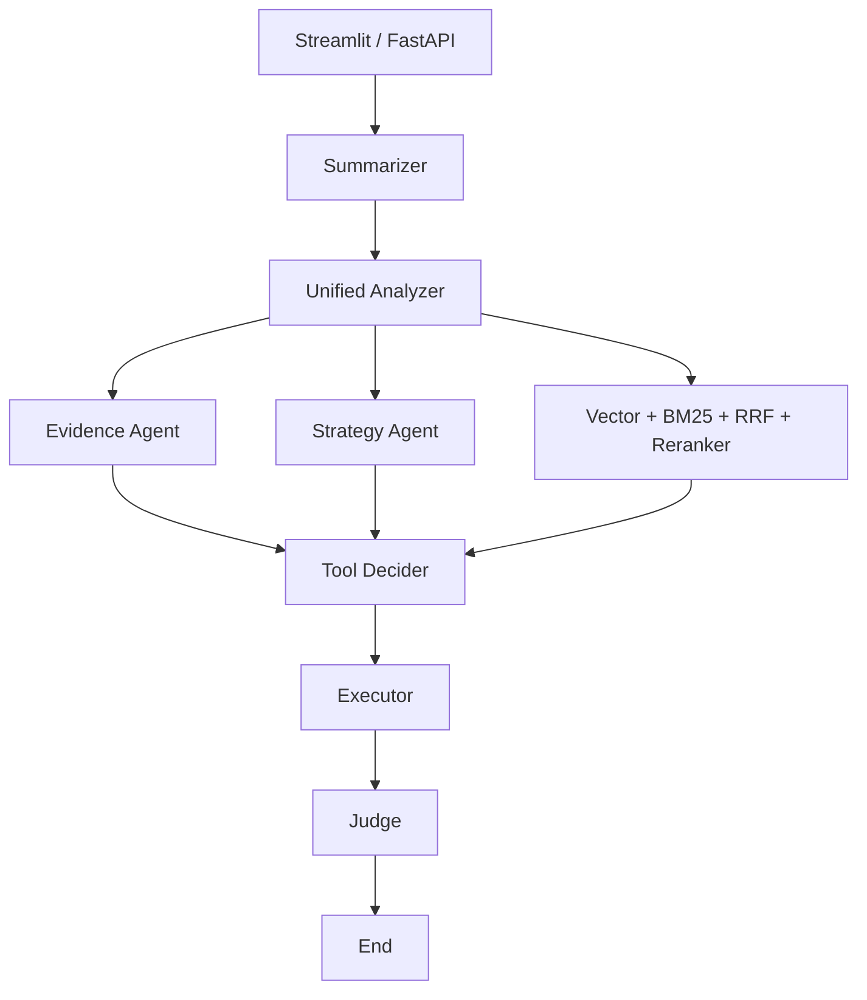
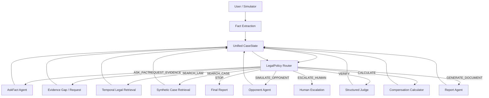

# LexPilot 第一阶段仓库审计

## 审计结论

当前仓库是一个面向《公司法》的多智能体 RAG 应用，主流程为固定的“摘要 → 分析 → 证据/策略/预检索 → 工具 → 执行 → Judge”。它具备可复用的 LangGraph、混合检索、GraphRAG、FastAPI、Streamlit、工具注册和结构化输出基础，但劳动争议在现有分类器中被明确判为 `OUT_OF_SCOPE`，且当前工作流不是由强化学习策略动态选择动作。

第一阶段应保留基础设施，替换工作流控制中心：统一使用 `CaseState` 表示案件信息，由 `LegalPolicy.predict(state)` 选择离散 `LegalAction`，将动作映射到真实 Agent/Tool，执行后更新同一个 `CaseState` 并再次决策。

## 当前架构

该图是固定有向流程。Judge 仅在输出后质检，Policy 不参与路由，无法形成 `s_t → a_t → s_(t+1)`。

## 主要模块与处置

| 模块 | 当前作用 | 处置 | 原因 |
|---|---|---|---|
| `backend/graph.py` | 固定 LangGraph 编排 | 修改 | 改为 Policy Router 动态条件路由 |
| `backend/schemas.py` | 旧 `AgentState` 与 Agent 输出模型 | 修改 | 以统一 `CaseState` 为工作流权威状态 |
| `backend/agents/*` | 公司法分析、证据、策略、Judge、输出 | 部分保留并扩展 | 保留 LLM/RAG 能力；新增事实调查、对方模拟、结构化 Judge/报告 |
| `backend/retrieval/*` | Vector、BM25、RRF、重排、GraphRAG | 保留并适配 | 不重复造轮子；新增劳动法时效过滤接口 |
| `backend/tools/*` | 工具注册、股权计算、文书、有效性检查 | 保留注册层，修改法律工具 | 增加劳动补偿确定性计算工具 |
| `backend/api.py` | FastAPI/SSE 聊天接口 | 修改 | 返回动作、案件状态、时间线和结构化报告 |
| `app.py` | Streamlit 公司法聊天 UI | 修改 | 保留 Streamlit 外壳，增加案件健康度、证据缺口、当前动作和决策时间线 |
| `data/*` | 公司法正文、解释、知识图谱 | 保留 | 不删除有效资产；新增劳动法源元数据 |
| `eval/*` | RAGAS 公司法评估 | 保留 | 与新 Policy 评估并存 |
| `scripts/*` | 向量库和知识图谱构建 | 保留 | 后续劳动法语料可继续使用 |
| 测试 | 当前无 `tests/` | 新增 | 覆盖状态、动作、奖励、环境、策略、证据缺口和 STOP |

## 需要新增

- `backend/legal_rl/`：动作、统一状态、Policy、环境、观察向量、奖励、DQN 和训练入口。
- `backend/legal_domain/labor/`：六类劳动争议最小模型、证据缺口、主动追问、法源检索、赔偿计算。
- `backend/agents/ask_fact.py`、`opponent.py`、`report.py`：真实动作处理节点。
- `datasets/synthetic_cases/`：经标注为“待法学审核”的确定性合成案例。
- `evaluation/`：Random、Rule-Based、DQN 的统一指标评估。
- `tests/`：可离线运行的单元与工作流测试。

## 目标架构

## 风险与约束

- 当前目录没有 `.git` 元数据，无法提供可靠的 Git diff/分支状态；实现过程中仅修改当前文件夹。
- 当前劳动法知识库不是完整法规库。第一阶段只提供官方法源元数据、时效字段和可追溯接口，最终法律结论仍需法学成员审核。
- LLM、Embedding 和 Reranker 依赖外部模型/API；核心决策、环境、测试和 Demo 必须能够离线运行。
- 合成案例用于软件验证和 RL baseline，不应直接作为法律真值发布。

