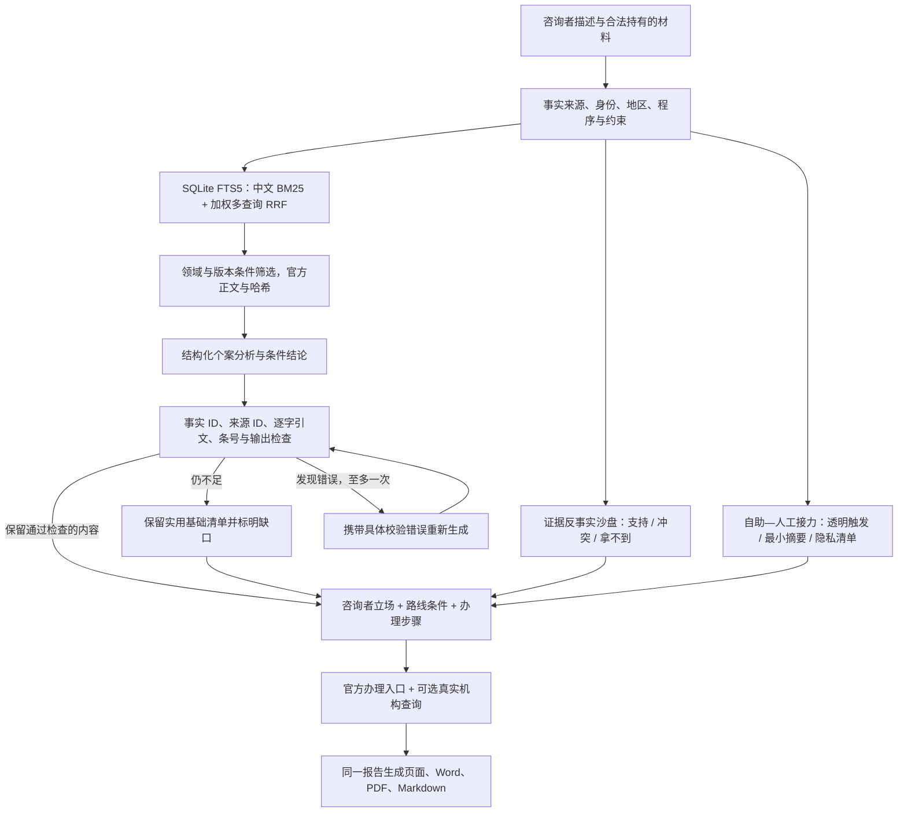

# LexPilot / 律策：AI+ 应用大赛技术说明

更新：2026-09-08。目标是把法律问答变成可追溯、可调整、能照着办理的行动方案，在咨询者的合法权益范围内比较实际回收、应付义务、时间和必要成本。

## 本次可演示的变化

1. 先检索当轮相关的官方法条正文，再让语义模型分析，修复原先先回答后搜索的问题。
2. 每个有依据的结论关联事实 ID、法源 ID、连续原文引句和适用条件；错误引用进入一次纠错，仍不合格的内容不进入结论与补充步骤。
3. 借款人、出借人、房东、租客、用人单位、劳动者采用不同咨询立场。显式身份来自对话原文，尚未核实的身份会提示确认；原有劳动者专门流程保留，用人单位走相应答辩路线。
4. 方案包含五个核心行动阶段及最多两项模型生成的个案补充步骤。已协商失败时切换第三方处理，已进入正式程序时优先现有文书和案号。
5. 每步提供建议日期、办理渠道、材料、具体操作、完成标志与失败替代路径。建议日期与法定期限分开，不在缺少起算事实时虚构截止日。
6. 页面及 API 均可下载中文 Word/PDF，包含全部行动、文书整理草稿、官方入口、条文正文及检查信息，来源链接可点击。

## 原创组合：证据反事实沙盘

竞品与研究给出的共同信号并不是“再做一个聊天框”。CoCounsel 的官方产品页把核心能力集中在面向法律专业人员的权威检索、文档分析与起草；英国司法部的法律支持综述认为数字自助适合作为可扩展的第一线支持，尤其适合程序明确的早期问题，但效果受可访问性、相关性和用户基础能力限制；Stanford 对法律 RAG 产品的实证评估则说明，即使使用检索增强，错误信息和错误归因仍不能被视为已经消除。

- [CoCounsel Legal 官方产品说明](https://legal.thomsonreuters.com/en/products/cocounsel-legal/corp)
- [英国司法部：法律支持服务有效性综述](https://www.gov.uk/government/publications/evidence-on-the-effectiveness-of-legal-support-literature-review)
- [Stanford：Hallucination-Free? 法律 RAG 可靠性研究](https://law.stanford.edu/publications/hallucination-free-assessing-the-reliability-of-leading-ai-legal-research-tools/)

LexPilot 因此增加面向普通咨询者的“证据反事实沙盘”。它不宣称是行业首创的法律推理算法，而是本项目的原创产品组合：

1. 从案件当前证据任务中优先选择已上传、用户称有、尚缺和需替代取证的材料。
2. 对每份材料同时显示“核对后支持当前陈述”“与其他材料冲突”“最终无法取得”三条路径。
3. 每条路径都说明要证明的事项、现在能做的动作、完成标志和不应越过的边界。
4. 概率字段固定为空；材料上传或用户自述不会被写成事实已证明。
5. 同一结构进入页面、API、Markdown、Word 和 PDF，并在质量审计中检查是否错误生成概率。

这一设计把“AI 给答案”改成“用户能看懂材料变化如何影响行动”，重点解决静态证据清单缺少策略反馈、普通用户容易把单份材料等同于胜诉、以及系统只展示有利路径而忽略冲突材料的问题。

## 原创组合：自助—人工接力通行证

英国法院数字支持服务 2026 年评估显示，受助用户的需求并不只是一种：85% 寻求数字操作支持，同时有 74% 寻求法律支持、69% 寻求程序支持；20% 的用户数字能力较低，服务结束后仍有 20% 不清楚下一步。英国司法部的法律支持综述也指出，数字自助虽然适合可扩展的早期支持，但效果受用户能力、数字包容和案件复杂度制约。英国在线程序规则委员会进一步把“保护和包容弱势用户、支持系统之间顺畅转移”列为数字司法标准方向。

- [英国法院与司法部：National Digital Support Service 评估摘要](https://www.gov.uk/government/publications/evaluation-of-the-national-digital-support-service/national-digital-support-service-findings-accessible-version-of-infographic)
- [英国司法部：法律支持服务有效性综述](https://www.gov.uk/government/publications/evidence-on-the-effectiveness-of-legal-support-literature-review)
- [英国在线程序规则委员会：数字司法下一步](https://www.gov.uk/government/news/statement-on-future-priorities-and-next-steps)

LexPilot 因此不把“留在聊天框里”设为默认成功标准，而是加入可逆的接力机制：

1. 仅根据已经记录的紧急提示、正式程序、涉外因素、事实冲突、领域复杂度及用户明确表达的协助需要选择接力强度，不推断年龄、残障或经济状况。
2. 每个建议保留触发信号和自然语言原因，可检查为什么是继续自助、协助自助、优先人工核对或立即接力。
3. 自动形成事实快照、未决问题、已有与缺失材料、联系话术、前两项准备动作及完成标志，减少跨渠道重新叙述。
4. 转交前提示最小披露、遮盖无关身份和账户信息，并强调系统不会自行把附件发送给任何外部机构。
5. 同一结构进入网页、API、Markdown、Word 和 PDF；质量审计检查触发信号是否可追踪及概率字段是否为空。

这不是对用户能力作隐性评分，也不是自动分配律师。它把“何时停止依赖 AI、怎样把已经做的工作安全交给人”变成产品的一等功能。

## 原创组合：本轮方案变更回执与持续红队

多轮咨询的风险不只在单次回答错误，也在于新事实或新材料进入后，用户无法判断旧建议为何改变。LexPilot 为每份阶段方案保存不含原始附件的结构化快照，并在下一次生成时逐项比较事实、证据状态、建议路线、接力强度与行动步骤。回执展示前值、现值、变化原因和方案影响；没有实质变化时也明确说明，不用胜率或结果概率解释变化。

配套红队生成器使用完全虚构、可重复的案例覆盖全部 16 类入口，以及双方身份、否定表达、明确更正、未解释冲突、程序进展、紧迫期限和材料耗尽。测试时在专用临时目录内生成最小 TXT、PDF、DOCX、PNG，经过真实多轮引擎、API、Streamlit 和导出路径；附件仅表示已接收，绝不自动标记为事实已证明。

## 技术闭环



实现位置：`backend/legal_domain/consultation/knowledge.py`、`semantic.py`、`grounding.py`、`perspective.py`、`planning.py`、`counterfactual.py`、`support_bridge.py`、`services.py`、`exports.py`。Web、离线执行器和 LangGraph 使用同一咨询处理函数；API 导出读取当前案件的最终报告。

## 研究方法与实现边界

| 参考 | 借鉴并实现的部分 | 没有宣称实现的部分 |
| --- | --- | --- |
| [Self-RAG，ICLR 2024](https://openreview.net/forum?id=hSyW5go0v8) | 检索后生成、检查生成与来源关系、检查失败反馈纠正 | 没有训练 reflection tokens、没有复现原论文训练或成绩 |
| [Corrective RAG](https://arxiv.org/abs/2401.15884) | 对知识覆盖不足显式标记，保留官方搜索补充渠道和降级路径 | 未训练论文的检索评价模型，未实现原论文的全部分解重组算法；搜索摘要不自动成为已核验法条 |
| [RRF，SIGIR 2009](https://doi.org/10.1145/1571941.1572114) | 合并多个检索排名：`score(d)=Σ wᵢ/(60+rankᵢ(d))` | 当前是同一中文词法检索器的多查询融合，没有冒称向量检索或训练重排序器 |

当前查询依次使用原始问题与细节、领域关键词与目标、争点与程序提示，权重为 4、1、0.5。原始问题权重更高，减少宽泛扩展词挤占个案相关条文。现有劳动领域的事实—证据—要件—法条图继续使用；通用领域引用摘要不是完整要件图，更不是模型隐藏推理过程。

引用校验能发现不存在的 ID、拼造原文、错引条号、无条件结论及部分保证结果等问题。**它不证明引文必然蕴含结论，也不证明事实真实、全部例外已覆盖或法律判断正确。** 报告明确保留 `semantic_entailment_verified=false` 和 `legal_correctness_verified=false`，不向用户展示伪造胜率。

## 法律知识与外部数据

本次纳入 79 个官方全文条文快照：民法典 32、劳动争议调解仲裁法 12、消费者权益保护法 7、行政复议法 5、刑事诉讼法 6、民事诉讼法 9、公司法 4、诉讼费用交纳办法 4。每条保留完整正文、法名、条号、官方 URL、版本开始日期、抓取日期及 SHA-256。具体来源可在 `data/legal_knowledge.json` 检查。

SQLite 使用 FTS5 与中文双字切分，不需启动额外数据库服务。案件发生日期早于已收录实体法版本时排除该版本；程序法按当前日期筛选并提示核对实际办理时点和过渡规则。日期不明时明确标记。抓取成功只表示获得官方页面正文，不能据此声称已建立全量、永远最新的法律库。

更新命令：

```powershell
.venv\Scripts\python.exe scripts/sync_legal_knowledge.py
```

更新器仅访问清单中公开的官方页面，限制并发、跳转、超时和正文大小，抓取失败保留相应已有快照；清单删除的条文同步从受管理索引移除。新增法条需先审查清单的版本日期、领域和正文提取结果。未接入未经授权的商业裁判案例数据库。

| 配置 | 实际作用 | 未配置或失败时 |
| --- | --- | --- |
| `DASHSCOPE_API_KEY`（兼容 `QWEN_API_KEY`） | 既有 Qwen 个案语义分析，保留原文锚点与结构校验 | 分领域基础接谈与行动清单仍可用 |
| `SERPER_API_KEY` | 搜索官方域名的法律与司法解释线索，只发送领域和法名 | 提供官方检索入口，明确未完成联网核验 |
| `AMAP_API_KEY` | [高德地点搜索 API](https://lbs.amap.com/api/webservice/guide/api/search/)，仅发送城市与机构类别 | 提供官方在线办理入口和 12368 / 12348 / 12333 / 12315 核对用语，不编造街道地址 |
| `LEXPILOT_KNOWLEDGE_DB` | 更改本地法律索引路径 | 使用 `.local_data/legal_knowledge.sqlite3` |

地图结果仅为候选机构位置，不能以“离用户近”推定法院管辖。地址、办公时间、预约及材料份数需向受理机构确认；未获取的字段不会用模型猜测补齐。当前开发环境已配置语义模型，未配置 Serper、高德密钥；后两项已做模拟接口测试，尚未完成真实密钥联调。

聊天按既有机制脱敏后调用模型；附件原文不随此次语义请求上传。法律检索在本地完成，搜索和地图不发送案情原文。Word/PDF 在内存中生成，不上传外部转换服务；下载缓存按单个 Streamlit 会话和报告内容区分。API 返回 `private, no-store`。

## 实验与验收

```powershell
.venv\Scripts\python.exe -m pytest -q
.venv\Scripts\python.exe scripts/evaluate_consultation.py
```

2026-09-09 加入持续红队、事实来源优先级审计、方案变更回执与证据可信度分级后的全量测试为 **216 项通过**。新增测试覆盖 16 类入口、双方身份、否定表达、明确更正与真实冲突、上传材料与用户陈述不一致、程序进展、“后天开庭”与“3 日内补正”等紧迫期限、材料耗尽、匿名多格式上传、网页/API/导出一致性，以及“有转账、没有借条、催款被拒”不会发生跨材料否定或重复协商。劳动证据现在区分用户自述、已上传待核验和人工已核验；前两者只能形成部分支持，系统仍可给出带限制条件的阶段方案，但不会标记为已经证明。

检索消融使用 `eval/consultation_benchmark.json` 的 18 个手写场景，覆盖 15 个专门领域。结果保存在 `evaluation/consultation_results.json`：

| 模式 | Hit@5 | Recall@5 | MRR | 本机平均检索延迟 |
| --- | ---: | ---: | ---: | ---: |
| 单查询 BM25 | 1.0000 | 1.0000 | 1.0000 | 1.86 ms |
| 加权多查询 RRF | 1.0000 | 0.9722 | 1.0000 | 4.99 ms |

这组结果**没有证明融合优于单查询**；泛化扩展在一个场景中降低了召回。该数据集很小、人工编写、领域标签已知且已用于调试，不是盲测，更不是 100% 法律回答准确率。当前结果用于防退化与暴露取舍。实际准确率需要另行构建独立案件集，由专业人员标注适用法、必要条件、错误严重程度与步骤可执行性，再进行盲评。

真实模型以一则虚构的深圳租房押金场景完成端到端测试，最新一次耗时 14.86 秒、一次调用、两项通过引用结构检查的条件结论。首位检索结果是民法典第七百一十条，直接涉及正常使用造成的损耗。它验证调用链能工作，不代表平均延迟、法律正确性或所有场景表现。Word/PDF 的中文正文、链接和页码另做解析与实际页面检查。

## 比赛现场演示

1. 启动 `streamlit run app.py`，输入：“我在深圳，我是租客，2026年8月31日退租交了钥匙，房东扣3000元押金，说墙面有正常使用的印子。我有租约、转账、交房视频，已经协商三次被拒绝。希望低成本拿回押金，请给我具体方案。”
2. 展示方案从已经失败的协商转向适配第三方与正式救济；查看具体材料、操作、日期与停止等待条件。
3. 展开依据，说明用户陈述、官方原文、引用结构检查和法律适用确认是不同层次。
4. 在新案件中以“我是房东”咨询欠租，展示立场、话术和证据方向变化。
5. 下载 Word 和 PDF，打开核对完整行动方案、官方链接和条文附录。
6. 展开“证据反事实沙盘”，以转账记录或交房视频演示：材料支持时如何进入证据目录、发生冲突时为什么不能隐藏不利内容、拿不到时怎样切换替代取证；指出概率字段固定为空。
7. 展开“自助—人工接力通行证”，先展示普通借贷案件可以继续自助；再输入“已经收到法院传票，我看不懂线上操作，需要人帮忙”，展示接力强度、触发原因、事实快照、未决问题、材料缺口和联系话术同步变化。

API：先通过 `/chat` 在同一 `thread_id` 生成方案，再请求 `/cases/{thread_id}/report.docx` 或 `/cases/{thread_id}/report.pdf`。不存在案件返回 404，尚无报告返回 409，不支持的格式返回 400。

## 交付范围

已更新源代码、示例配置、桌面打包导入清单、知识快照和回归实验。未重新构建或发布安装包。会话仍沿用原应用内存状态；面向公众部署前的账号鉴权、案件持久化、权限隔离和专业复核机制不属于本轮已交付能力。

“对用户有利”在这里落实为：及时止损、保住程序权利、核对可证明请求或真实义务、避免重复费用、选择可执行安排。无法保证胜诉、保证退款或数学意义上的最优收益，也不通过造假、隐匿财产或侵入隐私来追求利益。
